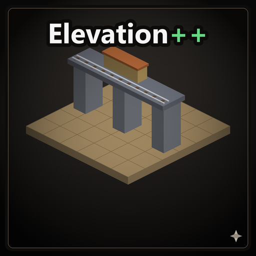

# Elevation++

A [Captain of Industry](https://www.captain-of-industry.com/) mod that adds **elevated train stations** and raises the height and pillar-spacing limits of elevated rails, pipes and belts.



## Features

### Elevated train stations
Every train station can be built **elevated on auto-rendered support pillars**:

- The root, all cargo modules (unit, loose, fluid, molten, empty) and fuel modules (coal, liquid, nuclear) — for both **normal and electrified** rail.
- They live in a dedicated **"Elevated stations"** toolbar tab, grouped and ordered like the vanilla Stations menu (root first, molten last), reuse the vanilla icons, and unlock with the **same research** as their ground counterparts.
- A non-electrified elevated station can be converted in place with the vanilla **"Electrify track"** tool, just like a ground station — including growing the catenary support masts on the platform.

### Higher limits for elevated structures
All four values are editable in the in-game mod settings (and in `config.json`); changes apply immediately:

| Setting | Vanilla | Default | What it does |
| --- | --- | --- | --- |
| `RailPillarMaxHeight` | 6 | 16 | Max rail-pillar height; also the rail build cursor's up-arrow cap. |
| `RailPillarSupportDistance` | 7 | 14 | Max distance an elevated track may sit from a supporting pillar. |
| `TransportPillarMaxHeight` | 6 | 16 | Max pipe/belt pillar height. |
| `TransportPillarSupportDistance` | 4 | 8 | Max distance a pipe/belt may sit from a pillar (auto-built pillars end up ~2× this apart). |

> ⚠️ **Warning:** if you remove the mod (or lower the values) after building structures that exceed the vanilla limits, those structures become unsupported and may collapse. The mod is therefore flagged as **not removable** from a save once added.

## Install

Copy the contents of a release (the `ElevationPP` folder containing `ElevationPP.dll`, `0Harmony.dll`, `manifest.json`, `config.json`, `thumbnail.png`, `changelog.txt`) into:

```
%APPDATA%\Captain of Industry\Mods\ElevationPP
```

## Build from source

Requires the game installed and Visual Studio's MSBuild (the manifest version generator uses `CodeTaskFactory`, which `dotnet build` does not support).

```powershell
$env:COI_ROOT = '<path to>\Captain of Industry'
$env:COI_MODS = "$env:APPDATA\Captain of Industry\Mods"
& 'C:\Program Files\Microsoft Visual Studio\2022\Community\MSBuild\Current\Bin\MSBuild.exe' `
    'src\ElevationPP.csproj' -p:Configuration=Release
```

The build deploys into the Mods folder and produces a `ElevationPP_<version>.zip` next to it.

## How it works

The mod is implemented against the game's own APIs (no game code is redistributed):

- **Pillar limits** are reflection patches on the static height/support-distance fields the build controllers read.
- **Elevated stations** clone each vanilla station proto onto an elevated trajectory with a `UsingPillar` footprint, plus custom serializable entities for the loading modules.
- A small set of **Harmony patches** make the vanilla electrify tool work in place on the elevated stations (collision/occupancy/replace validators and catenary-pole placement), each narrowly gated to the mod's own elevated-station protos so vanilla behaviour is untouched.

## Author

Roest

## License

Captain of Industry Open Modding License (CoI-Open).
